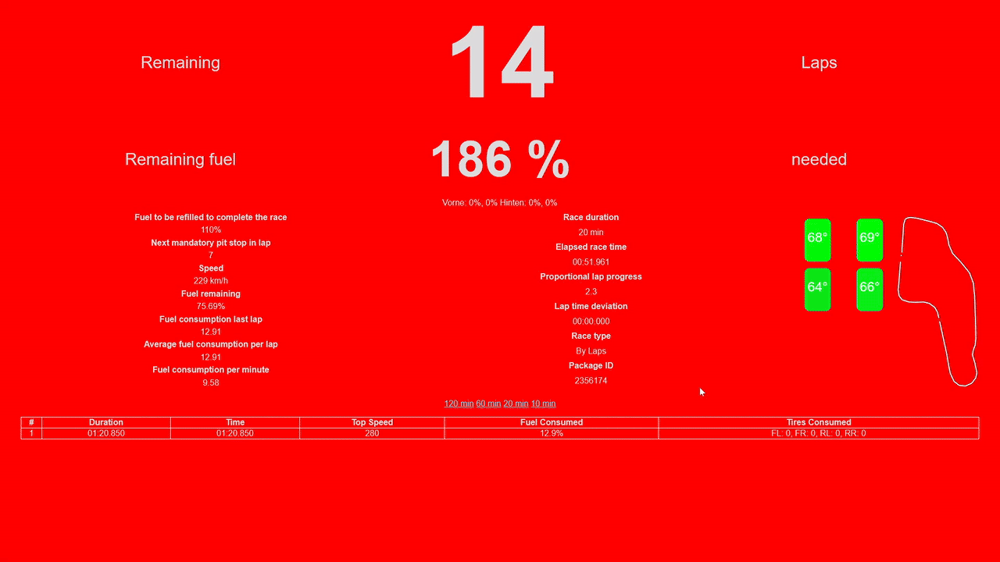

## GT7 Fuel Dashboard



## Usage

```cmd
./gt7fuel.exe --help
Usage of gt7fuel.exe:
  -dump-file string
        Dump file for loading dumped data instead of real telemetry
  -parse-twitch
        Set to true to enable parsing Twitch (default true)
  -race-time int
        Race time in minutes (default 60)
  -twitch-url string
        Twitch channel URL to parse
```

## Download

See Releases. Works on Mac, Linux and Windows.

## Functionality

- **Dynamic Background Color**
  - The dashboard changes its background based on the need for refueling:
    - **Green**: No Refuel necessary, finish the race in the current stint
    - **Blue**: You will have to refuel to finish the race
    - **Yellow**: Not enough data for calculating fuel consumption (first lap of the race)
- **Dynamic Background Alerts**
  - The dashboard flashes its background color based on critical driving conditions:
    - **Red**: Activates when "rising trail braking" is detected.
    - **Light Blue**: Indicates when "traction control system (TCS) is active."
- **Race Progress and Fuel Strategy**
  - Displays remaining laps in the race.
  - Shows the fuel needed to complete the race.
  - Calculates fuel to be refilled during pit stops.
  - Displays estimated next mandatory pit stop.
- **Performance Metrics**
  - Current speed.
  - Fuel remaining.
  - Fuel consumption data (last lap, average per lap, and per minute).
  - Lap time deviation.
  - Proportional lap progress (Not yet working).
- **Race Information**
  - Total race duration.
  - Elapsed race time.
  - Race type.
  - Package ID for telemetry data.
- **Tire Wear Visualization**
  - Displays tire wear based on experimental Twitch stream parsing
- **Tire Temperature Visualization**
  - Displays a graphical representation of tire temperature using tire icons.
- **Map Integration**
  - Placeholder for a race track map.
- **Error Handling**
  - Provides an error message container to display alerts when telemetry data is unavailable.
